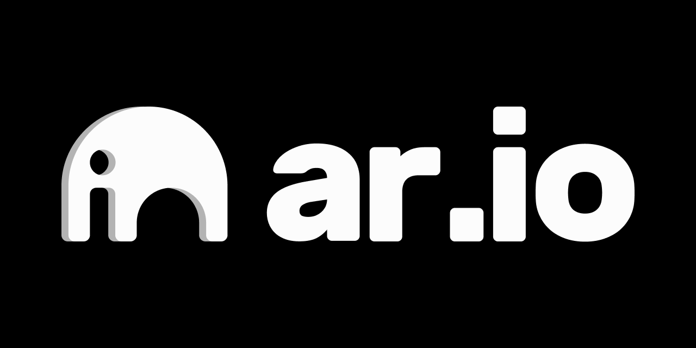

# AR.IO Foundation Grant Program

The AR.IO Foundation functions as the steward of the network, balancing its growth and development with a commitment to the community's needs and the network's foundational ethos. In support of this role, The AR.IO Foundation has developed a grants program to help empower and incentivise the AR.IO community to contribute to the Network's long-term success.

## Grant Focus Areas
Below are the areas in which we're currently most interested in receiving grants proposals.

- **Innovative Products or Applications**: products or applications built on-top of or utilizing Arweave Name System (ArNS) or Gateways that drive adoption and growth of the network.

- **Search and Discovery:** products or tooling that utilises AR.IO Network to improve the indexing, search and discoverability of content on the permaweb.

- **Developer Experience:** Tools, SDKs, libraries or products that improve the UX for developers building on AR.IO Network (Storage, Gateways, Domains).

- **Integrations:** Integrating AR.IO Network with popular existing tools and developer libraries.

- **Gateway Infrastructure and specialised implementations:** Tools for Gateway Operators, specialised gateway implementations for specific use-cases, extending gateway functionality or performance optimisations.

- **Community and Education:** Documentation, tutorials, starter kits, example implementations and educational content.

If you're interested in submitting a proposal that doesn't fit into these areas please reach out either directly via [email](mailto:grants@ar.io?subject=Grants%20Inquiry) or in the grants channel in our [discord](https://discord.com/invite/HGG52EtTc2). We appreciate any and all ideas and the focus areas may evolve over time based on feedback and interest from the community.

## Grant Types

---

### Micro Grants
Micro Grants of up to $1,000 are available to any member of the AR.IO Community for small, tightly scoped pieces of work that help grow the AR.IO Network and can be delivered within 2 - 4 weeks. These grants are paid upon successful delivery, and we aim to review applications within one week.

Examples of eligible micro grants include: articles, tutorials, starter kits, video content, community engagement efforts and small integrations with ecosystem tooling.

To submit a Micro Grant please create an Issue using the Micro Grants template and follow the instructions included there.

### Open Proposals
Open Proposals are available to individuals, teams and enterprise for more significant contributions to support the growth, utility and adoption of AR.IO Network. Funding is available from $1,000 up to $50,000 depending on the size, scope and impact of the idea.

If you're interested in submitting an Open Proposal please follow the [application guidelines](#application-guidelines) below!

---

### Requests For Proposals (RFPs)

From time-to-time, the AR.IO Foundation will propose work request to the community in the form of an RFP. All community members, small teams and companies are welcome to apply. Responses from multiple teams are expected, the AR.IO Foundation will then select the best response(s) and award the work to the team (s) that submitted it.

**Open:**
- [Rewind - A Visual ArNS History Explorer](/RFPs/Rewind-a-Visual-ArNS-History-Explorer.md) (Applications close: 2025-06-07)
- [ArNS Marketplace - Trustless Name Trading on the Permaweb](/RFPs/ArNS-Marketplace-Trustless-Name-Trading-on-the-Permaweb.md) (Applications close: 2025-06-12)

---

## Application Guidelines

*Note: Guidelines for RFPs will be defined separately when an RFP is posted*

### Open Proposal Application Process

1. [Create a new issue]([url](https://github.com/ar-io/ar-io-grants/issues/new?template=open-proposal.md)) on this repo using the `Open Proposal` template.

2. The Grants Committee will complete an initial review and provide feedback generally within 2 weeks of your proposal being posted. Some proposals may be rejected at this stage or require further clarification or amendments before being possibly accepted.

3. If your proposal is accepted, you'll be required to review and sign the grant agreement before commencing work. Grants should not be treated as final or the funding approved until the grant agreement has been signed by both parties.

_**Important disclaimer:** grant proposals must follow the provided guidelines and templates otherwise risk being immediately rejected. If you have questions or need support for during grant application, please reach out to the #grants channel in our [Discord](https://discord.com/invite/HGG52EtTc2) or [email us](mailto:grants@ar.io?subject=Grants%20Inquiry) directly._

### Funding Levels & Eligibility

When making an application for a grant, it is important to consider how the eligibility criteria and funding levels outlined below apply to your application prior to submission.

|          | **Small**                                                                                                                                                                                                                                                   | **Medium**                                                                                                                                                                                                                                                                                                       | **Large**                                                                                                                                                                                                                                                                                                        |
|----------|-------------------------------------------------------------------------------------------------------------------------------------------------------------------------------------------------------------------------------------------------------------|------------------------------------------------------------------------------------------------------------------------------------------------------------------------------------------------------------------------------------------------------------------------------------------------------------------|------------------------------------------------------------------------------------------------------------------------------------------------------------------------------------------------------------------------------------------------------------------------------------------------------------------|
| Amount   | $1,000 - $5,000                                                                                                                                                                                                                                               | $5,000 - $25,000                                                                                                                                                                                                                                                                                                 | $25,000 - $50,000                                                                                                                                                                                                                                                                                                 |
| Eligibility | <ul><li>Open to anyone</li><li>Some prior relevant domains experience is required</li><li>Should demonstrate some contribution to the improving the growth, adoption or utility of the network</li><li>Deliverables and funding broken down into milestones, payments made on completion of each milestone.</li></ul> | <ul><li>Open to teams and enterprises.</li><li>Proven domain experience and track record of delivery.</li><li>Demonstrates meaningful contribution to the growth, adoption or utility of the network.</li><li>Deliverables and funding broken down into milestones, payments made on completion of each milestone.</li></ul> | <ul><li>Open to teams and enterprises</li><li>Significant domain experience and track record of delivery.</li><li>Demonstrates significant contribution to the growth, adoption or utility of the network</li><li>Deliverables and funding broken down into milestones, payments made on completion of each milestone.</li></ul> |

### Licensing

#### Open Source requirement
By default, all work funded via the grants program should be open-source and publicly available using one of the approaved licensing options:

1. **Permissive Licenses** - MIT or Apache 2.0
Use for tools, libraries or widely reusable code

2. **Copyleft Licenses** - GPLv3, AGPLv3 (for hosted services)
Use for governance tools, infrastructure, or systems where openness must be preserved.

3. **Dual Licensing (Recommended)**
Combine a copyleft license (e.g. AGPLv3) with a permissive license (e.g. Apache 2.0). Encourages adoption while protecting openness.

#### Closed sourced exceptions
Exceptions may be made on a case-by-case basis for integrations with existing ecosystem tooling. These proposal should have the potential for significant impact on the growth, adoption and utility of the AR.IO Network to be considered. If a closed source exception is granted, the Grantee must provide a detailed technical write-up of the integration to be shared publicly with the AR.IO Community.

### Evaluation Criteria

The Grants committee will evaluate applications based on the following criteria:

| **Criteria**    | **Description**                                                                            |
|-----------------|--------------------------------------------------------------------------------------------|
| Impact          | Will this proposal directly and positively impact the AR.IO Ecosystem.          |
| Innovation      | What innovation does this grant bring to AR.IO Network that differentiates it from existing solutions.           |
| Experience      | Do the grantees have the relevant knowledge to deliver the proposal successfully.           |
| Feasibility     | Is the proposal sufficiently scoped with clear and achievable milestones.                     |
| Mission/Vision  | Does the proposal align with the mission/vision of AR.IO Network.             |

### Milestone Reporting

#### Milestone Delivery

Milestones should be reported publicly on the original Github Issue.

#### Milestone Review

The Grant Committee will review the milestone submission and may issue comments and request changes on the issue. Their feedback needs to be resolved before a milestone can be accepted. Meetings with the Grantee can be requested if needed to discuss comments and changes requests prior to the milestone being accepted.

#### Milestone Payment

Payments are usually processed within 14 days. Payments are made in ARIO to the wallet specified in the Grant Application. The exchange rate for ARIO will be calculated based on the price of ARIO on coingecko at time of payment.

Grant applications can be amended by the Grants Committee. However, this necessitates a reevaluation by the committee.

---

### Grants Committee

Members of the AR.IO Foundation and Permanent Data Solutions Inc who understand the priorities of the ecosystem and can make required initial funding decisions based upon the guidelines of the grant program. This committee is a balance of technical and business focused contributors.

- Ecosystem: [William Kempster](https://x.com/kempsterrrr)
- Marketing: [Jenny LaVelle](https://x.com/jennymlavelle)
- Design: [Lucas Porter-Bakker](https://x.com/porterbakker)
- Engineering: [Ariel Melendez](https://github.com/arielmelendez) / [Dylan Fiedler](https://github.com/dtfiedler) / [David Whittington](https://github.com/djwhitt)
- Business: [Phil Mataras](https://x.com/vilenarios), [Jonathan Policke](https://x.com/JonnieSparkles)

---

### Grants Support

If you have any questions about the grants program or require support, please reach out in the grants channel in [Discord](https://discord.com/invite/HGG52EtTc2) or [email us](mailto:grants@ar.io?subject=Grants%20Inquiry) directly.
